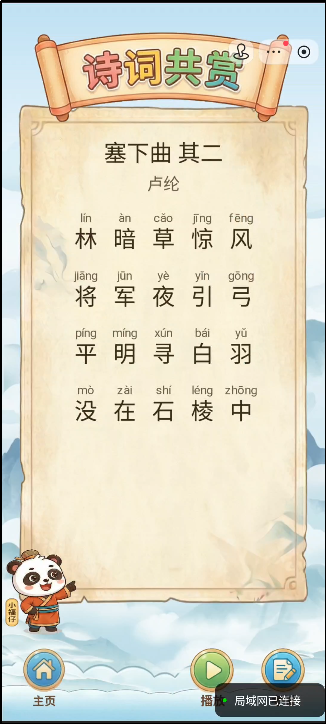

# Tang300 — AI 辅助构建的抖音小游戏全栈示例

> 本仓库是一份 **MIT 开源**的参考样例：Canvas 客户端 + 云函数后端 + 3 首示例诗词，展示如何在 **Cursor** 协作下开发抖音小游戏，供对照与学习，并非成品级教程。

[English README](./README.md)

---

## 这个项目适合谁

如果你正在摸索 **Cursor 怎么参与实际开发**，尤其是 **Canvas 小游戏**这类没有 DOM、不好一眼看出「该改哪」的项目，本仓库可作为一份**个人实践留下的开源底稿**。

可能对你有帮助的情况：

- **想从真实代码里看分模块协作的痕迹** — 运行时边界、UI 尺寸收敛、`store/` 桥接宿主 API 等做法都体现在源码结构中（完整协作规约见文末[扩展参考包](#扩展参考包tang300-pro)）。
- **需要一个能跑起来的抖音小游戏起点** — `client.minigame/` 可导入字节跳动开发者工具；自带 3 首示例诗词，便于本地联调。
- **独立开发者想少踩一些基础坑** — 触摸矩阵、排版、云函数登录等已有一个能用的雏形，可在本仓库基础上继续改。

---

## 本仓库内容

| 路径                      | 说明                          |
| ----------------------- | --------------------------- |
| `client.minigame/`      | 小游戏 Canvas 前端（入口 `game.js`） |
| `server.cloudfun/`      | 云函数后端（登录闭环示例）               |
| `server.static/poetry/` | **3 首**示例诗词（JSON、索引、MP3）    |
| 本 README                | 说明、快速开始与扩展资源索引              |

全部代码在 **Cursor + Agent** 辅助下迭代完成。

  

---

## 技术实现参考

前端未使用 Cocos、Pixi.js、Laya 等游戏引擎，而是在宿主 **Canvas API** 上手工拼装。以下是当前代码里几块相对完整、可供对照的实现，并非最佳实践，仅作参考。

### 触摸矩阵与事件分发

沙箱里没有浏览器 DOM，无法 `addEventListener` 绑按钮。本项目用**全局 `touchRects` 队列**做碰撞分发：

- 各场景 / 弹窗在绘制时，向队列 **PUSH** 带坐标、`id` 与回调的矩形描述块
- `game.js` 里统一的 `onTouchStart` / `onTouchEnd` 遍历矩阵做命中检测并触发回调
- `touchend` 以 `touchstart` 命中的来源矩形为准，减少松手滑到邻区导致的误触

交互由每帧重建的静态数据驱动，避免多处动态绑定 / 解绑全局触摸带来的时序问题。细节见 `client.minigame/game.js` 与各 `scene/`、`dialog/`。

### 多行加权自适应排版

Canvas 没有现成排版引擎。考试与闯关场景的诗词格在 `examPoemBoxLayout.js` 中按视口比例（`vw` / `vh`）做加权分配：

- `isExamBoxNarrowChar` 识别窄标点，赋予较低权重
- `computeExamLineCellWidths` 反算每行各字格宽度，减轻竖排感错位与两侧留白不均

用于 `scene/exam.js`、`scene/challenge.js` 等处的逐字格绘制。

### 弹窗纸面九宫格与高度反算

非 DOM 弹窗的布局集中在 `lib/dialogLayout.js`、`lib/dialogPaperLayout.js`：

- 纸面背景用 `img/paper.png` **九宫格**拉伸，避免整图等比缩放变形
- 传入内容区底边 `contentBottomY`，由 `computeDialogPaperHeight` 反算纸面实际高度，再绘制按钮与文案

可参考 `dialog/examSuccess.js` 等文件的接入方式。

---

## 快速开始

本仓库定位为**技术参考**。代码已脱敏，运行前需自行配置：

1. 在 [抖音开放平台](https://developer.open-douyin.com/) 创建小游戏项目
2. 用 **Cursor** 打开本仓库根目录（与 `client.minigame/` 同级），按需描述修改任务即可
3. 修改 `client.minigame/game.config.js` 中的 `EnvId`、`ServiceID`、`poetrybaseurl` 等占位符
4. 修改 `client.minigame/project.config.json` 中的 `appid`
5. 对本仓库 `server.static/poetry/` 启动本地静态服务，作为诗词接口
6. 用抖音开发者工具打开 `client.minigame/`；本地调试时在「详情 → 工程配置」勾选「不校验合法域名、web-view（业务域名）、TLS 版本以及 HTTPS 证书」

---

## 与 Cursor 协作

本仓库开源的是**代码产物**；协作时的分层规约、可视化调试开关、完整排障记录等写在扩展参考包中。从本仓库代码仍能看出几条习惯：

1. **开发者定边界，Agent 填实现** — 目录与对外说明由开发者把关；函数体与布局交给 Agent。
2. **宿主 API 走 `store/`** — `scene/`、`dialog/` 不直接散落 `tt.xxx` 调用。
3. **排障先描述现象** — 例如「点击某按钮无反应」，再让 Agent 在关键路径加带标志的临时 log，复现后把日志发回分析。

**调试范例（考试按钮不跳转）**：调用链为 `learn.js` 按钮 → `touchRects`（`exam`）→ `onExamBtn` → `showExamView()` → `renderExam()`。常见根因包括 Helium 下触摸双绑定，以及 `touchend` 未以 `touchstart` 来源矩形为准。完整记录与协作话术见扩展包中的 `.cursor/README.md`。

---

## 诗词数据格式

本仓库含 3 首示例：`下江陵_李白`、`有为_李商隐`、`乌衣巷_刘禹锡`。增删或改诗时请遵守：

- `contentshow` 行数 = `pinyin` 行数；每行字数 = 该行拼音个数
- `index.json` 用稳定 id 映射 `{file}.json` / `{file}.mp3`
- 违反 schema 会导致考试格错位；格式见 `server.static/poetry/` 内任一首 JSON

---

## 许可证

本仓库采用 [MIT License](./LICENSE) 开源许可。

---

## 扩展参考包（Tang300 Pro）

若你希望拿到作者在同一项目上使用的**完整协作上下文**（而不只阅读开源切片），扩展包 **Tang300 Pro** 另外提供：

| 内容                      | 说明                                                                                      |
| ----------------------- | --------------------------------------------------------------------------------------- |
| `.cursor/` 规约全套         | `douyin-minigame.md`、`style.md`、`directories.md`、`README.md` 等；含运行时边界、UI 公式、目录语义与结案调试记录 |
| `server.static/poetry/` | **130+ 首**结构化唐诗（JSON、完整索引、MP3）                                                          |
| 协作与排障文档                 | 项目搭建、`gameProdSwitch` 可视化调试、双轨调试法、Agent 话术范例等（见扩展包 README）                              |

扩展包已包含与本仓库同源的可运行代码，开箱即可在 Cursor 中继续开发，无需再合并本 GitHub 仓库。

### 获取方式

> 链接待补充，发布前请填入真实地址。

| 渠道      | 适用               | 链接    |
| ------- | ---------------- | ----- |
| Gumroad | 海外（信用卡 / PayPal） | *待填写* |
| 爱发电     | 国内               | *待填写* |
| 面包多     | 国内               | *待填写* |

### 购买前请知悉

扩展包按「半成品参考」出售，请理性消费：

1. **不包教包会** — 不提供一对一教学，也不承诺购买后的技术答疑或长期维护。
2. **不合适可随时退款**，在对应平台发起退款即可。
3. 愿代码与 AI 能为你带来一点乐趣；若本仓库的开源部分已够用，不必勉强购买扩展包。

---

## 致谢

本项目由开发者与 Cursor Agent 协作完成，作为 **AI 构建受限环境小游戏** 的公开样例留存。代码随缘维护，不承诺 Issue 响应或功能更新。
